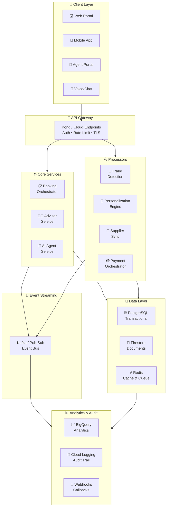

# TravelMind Platform 🚀

**Next-Generation, AI-Driven Travel Orchestration Platform**

A production-ready, cloud-native system that disrupts the travel industry by combining intelligent AI-powered booking orchestration, fraud-resistant transactions, dynamic personalization, and seamless human-AI advisor collaboration.

## Vision

TravelMind addresses critical travel agency challenges:
- **Compete with OTAs** via superior UX, lower latency, and AI-assisted personalization
- **Prevent fraud** with ML-based risk scoring and real-time anomaly detection
- **Maximize margins** through direct client relationships and dynamic pricing
- **Enable advisors** with AI copilots that augment (not replace) human expertise
- **Scale efficiently** with event-driven, multi-tenant cloud-native architecture

## Key Features

### 🤖 Intelligent Advisor AI
- Claude-powered travel assistant that understands complex requirements
- Real-time supplier integration with rate comparison
- Personalized recommendations based on traveler history
- Risk assessment for bookings (weather, geopolitical, health)
- Itinerary optimization using ML

### 🛡️ Fraud Prevention
- Multi-factor risk scoring (device fingerprint, behavioral analytics, payment patterns)
- Real-time anomaly detection using time-series models
- Policy-based transaction blocking with advisor override
- PCI-DSS compliant payment orchestration
- Biometric identity verification support

### 💰 Revenue Optimization
- Dynamic pricing intelligence (demand forecasting, competitor tracking)
- Commission structure management per supplier tier
- Margin analysis dashboards
- Upsell recommendations via AI
- Direct booking channel for repeat clients (15-30% margin boost)

### 📊 Personalization Engine
- Traveler segment clustering (luxury, budget, adventure, family)
- Collaborative filtering for destination recommendations
- Predictive booking window modeling
- Behavior-based content personalization
- Real-time preference learning

### 🔄 Supplier Integration
- Unified rate synchronization across 500+ suppliers
- Fallback supplier logic for inventory failures
- Real-time booking confirmation tracking
- Automated supplier onboarding workflow
- SLA monitoring and performance analytics

### 📱 Multi-Channel Experience
- Web portal for direct bookings and self-service
- Mobile app with offline capability
- Agent dashboard for advisors (desktop/tablet optimized)
- Voice-enabled booking queries (telephony integration)
- WhatsApp/SMS integration for confirmations

## System Architecture



## Technology Stack

### Backend Services (Go 1.21+)
- **Web Framework**: Gin, gRPC for microservices
- **Database**: PostgreSQL (OLTP), BigQuery (Analytics), Firestore (Document store)
- **Caching**: Redis with Circuit Breaker pattern
- **Message Queue**: Google Cloud Pub/Sub / Kafka
- **AI Integration**: Claude API, Vertex AI for ML models
- **Observability**: OpenTelemetry, Datadog/GCP Cloud Trace

### Infrastructure
- **Container Orchestration**: Kubernetes (GKE/EKS)
- **IaC**: Terraform / AWS CDK
- **API Gateway**: Kong / Google Cloud Endpoints
- **Service Mesh**: Istio (optional, for Canary deployments)
- **CI/CD**: GitHub Actions / Cloud Build

### Frontend
- **Web**: React.js 18+, TypeScript, Tailwind CSS
- **Mobile**: React Native / Flutter
- **Real-time**: WebSockets, Server-Sent Events

## Quick Start

### Prerequisites
```bash
Go 1.21+
Docker & Docker Compose
kubectl 1.28+
PostgreSQL 15+
Redis 7+
```

### Local Development
```bash
# Clone and setup
git clone https://github.com/udaykishore-resu/travelmind.git
cd travelmind

# Setup environment
cp .env.example .env
# Edit .env with your configuration

# Install dependencies and start services
make dev-setup
make dev-up

# Run all services
make run-services

# Run tests
make test

# View API docs
open http://localhost:8080/swagger
```

### Verify Setup
```bash
# Check health status
curl http://localhost:8080/health

# View running containers
docker-compose ps

# Check logs
docker-compose logs -f api-gateway
```

### Production Deployment
```bash
# Build and push container images
make docker-build-all
make docker-push

# Deploy to Kubernetes cluster
kubectl apply -f k8s/

# Monitor rollout status
kubectl rollout status deployment -n travelmind

# Verify deployment
kubectl port-forward svc/api-gateway 8080:8080 -n travelmind
curl http://localhost:8080/health
```

## Project Structure

```
travelmind/
├── backend/
│   ├── cmd/
│   │   └── api-gateway/              # Main API entry point
│   ├── internal/
│   │   ├── config/                   # Configuration management
│   │   ├── db/                        # Database layer
│   │   ├── handlers/                  # HTTP handlers
│   │   ├── middleware/                # Auth, logging, tracing
│   │   ├── models/                    # Domain models
│   │   └── observability/             # Metrics & tracing
│   ├── migrations/                    # Database schemas
│   ├── Dockerfile                     # Container build
│   ├── go.mod                         # Go dependencies
│   └── Makefile                       # Build automation
├── k8s/
│   ├── api-gateway-deployment.yaml    # K8s manifests
│   └── ...
├── docker-compose.yml                 # Local dev environment
├── CONTRIBUTING.md                    # Developer guidelines
├── ARCHITECTURE.md                    # Architecture decisions
└── README.md
```

## Core Services Overview

### 1. **Booking Orchestrator** (Go)
Manages the complete booking lifecycle with saga pattern for distributed transactions.
- Multi-supplier rate aggregation
- Inventory holds & reservation management
- Payment processing orchestration
- Itinerary building & conflict detection
- Real-time confirmation tracking

### 2. **Advisor Service** (Go)
Multi-tenant advisor & customer management with collaboration features.
- Role-based access control (RBAC)
- Customer relationship management (CRM)
- Commission tracking & payouts
- Real-time availability & skill-based routing
- Agent performance analytics

### 3. **AI Agent Service** (Go + Claude API)
Claude-powered intelligent travel assistant.
- Natural language booking requests
- Complex itinerary planning
- Risk assessment & mitigation suggestions
- Personalized destination/supplier recommendations
- Real-time rate comparison & negotiation
- Multi-turn conversation context management

### 4. **Fraud Detection** (Go + Python ML)
Real-time risk scoring with interpretable ML models.
- Device fingerprinting & behavioral biometrics
- Anomaly detection (Isolation Forest, LSTM)
- Policy-based decision rules
- Advisor override workflows with audit trails
- Chargebacks & dispute tracking

### 5. **Personalization Engine** (Go + Vertex AI)
Collaborative filtering & predictive recommendations.
- Traveler segmentation (6-8 clusters)
- Destination affinity scoring
- Booking window prediction
- Dynamic content personalization
- A/B testing framework

### 6. **Supplier Sync** (Go)
High-throughput supplier integration & rate synchronization.
- Concurrent supplier rate pulls
- Inventory cache with TTL management
- Failed supplier fallback logic
- Rate change detection & notifications
- Supplier SLA monitoring

### 7. **Payment Orchestrator** (Go)
Secure, multi-method payment handling.
- Tokenization & PCI-DSS compliance
- Multi-gateway support (Stripe, Adyen, PayU)
- 3D Secure / Strong Customer Auth (SCA)
- Refund & dispute management
- Settlement reconciliation

## Key Design Patterns

### Distributed Transactions
**Saga Pattern**: Long-running transactions across services.
- Choreography via event stream for booking creation
- Orchestration for payment + supplier confirmation

### Caching Strategy
**Multi-layer Cache**:
- L1: Redis (rates, traveler prefs) - 15min TTL
- L2: PostgreSQL materialized views (aggregates)
- L3: CDN for static content (destinations, supplier logos)

### Async Processing
- Event-driven booking confirmations
- Batch analytics jobs (daily/hourly)
- Email/SMS notifications via workers
- Supplier sync polling with exponential backoff

### API Gateway
- Rate limiting (per user, per API key, per IP)
- Request authentication & authorization
- Request/response transformation
- Circuit breaker for downstream services
- API versioning & deprecation management

## Security Architecture

- **Auth**: OAuth2 / OIDC with JWT
- **Data Encryption**: TLS in transit, encryption at rest (CloudKMS)
- **Secrets Management**: Sealed Secrets / AWS Secrets Manager
- **Network**: VPC, Cloud Armor, WAF rules
- **Audit Logging**: All API calls logged with user context
- **Compliance**: PCI-DSS Level 1, GDPR, SOC2

## Observability Stack

- **Metrics**: Prometheus/Datadog (latency, error rate, throughput)
- **Logging**: Cloud Logging / ELK with structured JSON
- **Tracing**: OpenTelemetry with Jaeger/Datadog APM
- **Alerting**: PagerDuty for on-call escalation
- **Dashboards**: Grafana for ops, Metabase for business metrics

## Performance Targets

| Metric | Target | Implementation |
|--------|--------|-----------------|
| API Latency (p99) | <200ms | Redis cache, DB indexing |
| Booking Create | <2s | Event-driven, async payment |
| Supplier Sync | <30s | Concurrent pulls + cache |
| Fraud Detection | <100ms | ML model serving, redis |
| Search Results | <500ms | Elasticsearch + denormalization |
| Mobile App Load | <2s | Code splitting, PWA caching |

## Testing Strategy

- **Unit Tests**: 80%+ code coverage per service
- **Integration Tests**: Docker Compose, TestContainers
- **E2E Tests**: Playwright for web, Detox for mobile
- **Load Testing**: k6 / JMeter for peak scenarios (10k concurrent users)
- **Chaos Engineering**: Gremlin for resilience validation

## Deployment

### Local Development
```bash
# Start all services locally
docker-compose up -d

# Verify services are healthy
docker-compose ps
```

### Staging
```bash
# Deploy to staging cluster
kubectl apply -f k8s/staging/

# Monitor deployment
kubectl rollout status deployment -n travelmind
```

### Production
```bash
# Canary deployment (20% traffic)
kubectl apply -f k8s/production/canary/

# Monitor metrics for 30min, then promote
kubectl patch service api-gateway -n travelmind \
  -p '{"spec":{"selector":{"version":"v1.0"}}}'

# Rollback if needed
kubectl rollout undo deployment/api-gateway -n travelmind
```

## Roadmap

- [x] Core booking orchestration
- [x] AI agent integration
- [x] Fraud detection MVP
- [ ] Voice booking (Twilio integration)
- [ ] Advanced personalization (collaborative filtering v2)
- [ ] Mobile app launch
- [ ] Blockchain-based loyalty (optional)
- [ ] Supplier white-label portal
- [ ] Advanced analytics dashboards

## Contributing

See [CONTRIBUTING.md](CONTRIBUTING.md) for development guidelines.

## License

This project is open source and available under the MIT License.

## Contact & Support

- **GitHub Issues**: [Report bugs and feature requests](https://github.com/udaykishore-resu/travelmind/issues)
- **GitHub Discussions**: [Ask questions and discuss ideas](https://github.com/udaykishore-resu/travelmind/discussions)
- **Email**: udaykishoreresu2@gmail.com

---

Built with ❤️ by [Udaykishore Resu](https://github.com/udaykishore-resu)
